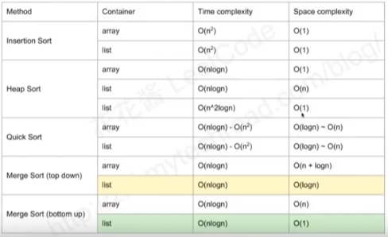

## [十大经典排序](https://www.cnblogs.com/onepixel/articles/7674659.html)     


### 经典问题
#### 求topk    


- 各种排序的时间复杂度    
      

- 稳定性
  - **排序前后，相同元素的相对位置不变则是稳定的**
  - 如果可能发生改变，则是不稳定的  


### 题目分类：
三种很重要：归并、快排、堆排    

#### 归并排序   
- 148-sort-list：要求常数级空间复杂度，只能使用 **链表**，自底向上的归并
- 剑指offer51-求数组逆序对：利用归并的 并过程


#### 快排 
- 


### 2. 高级排序-O(nlogn)     
（1）快速排序-递归思想         
数组取标杆pivot，小于pivot的元素放在其左侧，大于pivot的元素放在其右侧，然后依次对右边和右边的子数组继续快排          

**快排Java模板**    
```Java
public static void quickSort(int[] array, int begin, int end) {
    if (end <= start>)
        return;
    int pivot = partition(array, begin, end);
    quickSort(array, begin, pivot - 1);
    quickSort(array, begin, pivot + 1);
} 

static int partition(int[] a, int begin, int end) {
    int pivot = end, cnt = begin;
    for (int i = begin; i < end; i++) {
        if (a[i] < a[pivot]) {
            int temp = a[cnt]; a[cnt] = a[i]; a[i] = temp;
        }
    }
    int temp = a[pivot]; a[pivot] = a[cnt]; a[cnt] = temp;
    return cnt;
}
```

（2）      

```Java
public static void mergeSort(int[] array, int left, int right) {
    if (end <= start>)
        return;
    int mid = (left + right) / 2;
    mergeSort(array, left, mid);
    mergeSort(array, mid + 1, right);
    merge(array, left, mid, right);
}

public static void merge(int[] array, int left, int mid, int right) {
    int[] temp = new int[right - left + 1];
    int i = left, j = mid + 1, k = 0;

    while (i <= mid && j <= right) {
        temp[k++] = arr[i] <= arr[j] ? arr[i++] : arr[j++];
    }
    while (i < mid)
        temp[k++] = arr[i++];
    while (j <= right)
        temp[k++] = arr[j++];
    
    for (int p = 0; p < temp.length; p++) {
        arr[left + p] = temp[p];
    }

}

```


（3）堆排序 - 堆插入O(logn)，取最大/最小值O(1) 
- 数组元素依次建立小顶堆
- 依次取堆顶元素，并删除    


### 3. 特殊排序-O(n)    
（1）计数排序/Counting Sort       
要求输入数据必须具有确定范围的整数，将输入数据转化为键存储在额外开辟的数组空间，依次将计数大于1的填充回原数组       

（2）桶排序/Bucket Sort    
计数排序的升级版，假设输入数据服从均匀分布，将数据分到有限数量的桶里，每个桶再分别排序     

（3）基数排序/Radix Sort    


