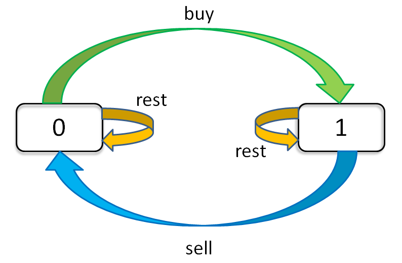

[参考链接](https://leetcode-cn.com/problems/best-time-to-buy-and-sell-stock-with-cooldown/solution/yi-ge-fang-fa-tuan-mie-6-dao-gu-piao-wen-ti-by-lab/)          

这个问题的「状态」有三个，第一个是天数，第二个是允许交易的最大次数，第三个是当前的持有状态         
分别用buy, sell, rest表示      

         


```   
dp[i][k][0] = max(dp[i-1][k][0], dp[i-1][k][1] + prices[i])
              max(   选择 rest  ,           选择 sell      )

解释：今天我没有持有股票，有两种可能：
要么是我昨天就没有持有，然后今天选择 rest，所以我今天还是没有持有；
要么是我昨天持有股票，但是今天我 sell 了，所以我今天没有持有股票了。

dp[i][k][1] = max(dp[i-1][k][1], dp[i-1][k-1][0] - prices[i])
              max(   选择 rest  ,           选择 buy         )

解释：今天我持有着股票，有两种可能：
要么我昨天就持有着股票，然后今天选择 rest，所以我今天还持有着股票；
要么我昨天本没有持有，但今天我选择 buy，所以今天我就持有股票了
```