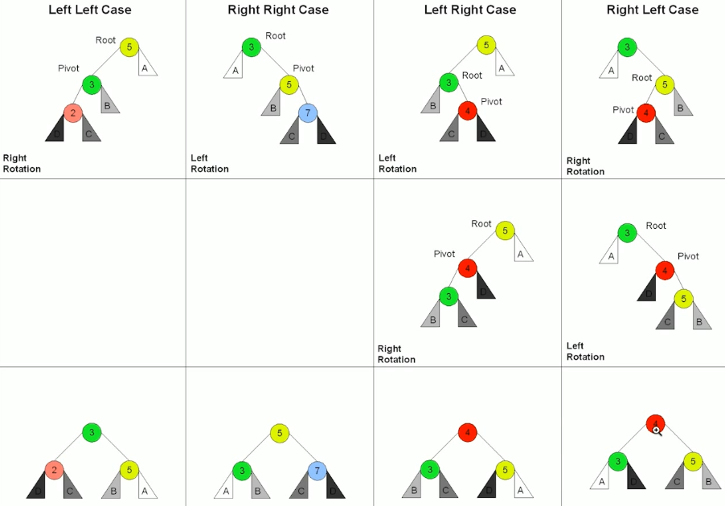

### 由二叉搜索树引入平衡二叉树：     
在使用二叉搜索树时，为了保证其O(logn)的时间性能，需要尽可能的平衡左右子树结点        

常见的平衡二叉树： AVL树、红黑树        

### 1.AVL树（自平衡二叉搜索树）  
（1）AVL来源于发明者的姓名  
（2）引入平衡因子（Balance Factor）    
左子树高度减去右子树高度（有时相反），记录所有结点的高度，并且所有结点的balance factor={-1, 0, 1}             

key: 需要平衡因子的原因？？        
查询的时间复杂度等于树的深度，需要记录深度差        
       
（3）通过旋转操作来进行平衡       
四种旋转操作：    

- 左旋         
  比如右右子树，右侧一串   
- 右旋       
  比如左左子树，左侧一串  
- 左右旋     
  左右子树 --> 左右旋     
- 右左旋    
  右左子树 --> 右左旋         
        

      

（4）**AVL的不足之处**       
结点需要存储额外信息，调整次数频繁        

### 2.红黑树/Red-black Tree       
是一种**近似平衡**的二叉搜索树，任何一个结点的左右子树高度差小于两倍    
红黑树的性质：  
- 每个结点要么是红色，或者是黑色    
- 根节点是黑色   
- 每个叶结点是黑色的   
- 不能有相邻接的两个红色结点    
- 从任一结点到每个叶子结点的所有路径，都包含相同数目的黑色结点        

在这种近似平衡的状态下，红黑树的平均时间复杂度能够很好的保持在log(n)，特殊情况下也不会退化。并且也折中了调整时间         

### AVL树与红黑树的对比   
红黑树是相对于AVL树的tradeoff     
- 