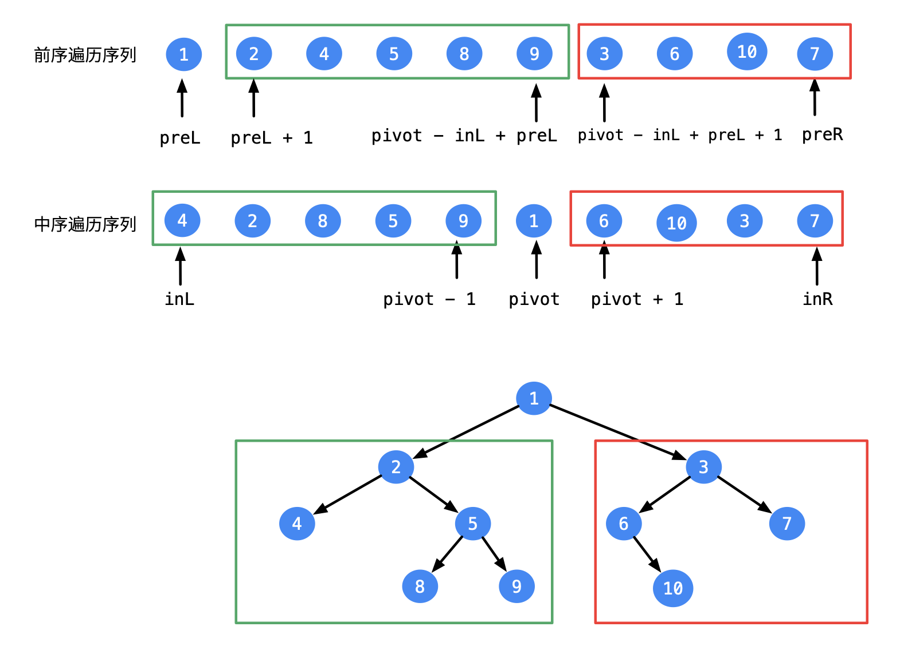

关键点：
- 前序遍历的第一个节点是根节点
- 在中序遍历，根节点的两侧是左右子树     



  

#### 法一：递归+分治

https://leetcode-cn.com/problems/zhong-jian-er-cha-shu-lcof/solution/mian-shi-ti-07-zhong-jian-er-cha-shu-di-gui-fa-qin/

```python
class Solution:
    def buildTree(self, preorder: List[int], inorder: List[int]) -> TreeNode:
        def recur(root, left, right):
            # 递归终止条件，说明已经越过叶子节点
            if left > right: return 
            # 前序遍历的第一个是 根
            node = TreeNode(preorder[root])
            
            # 根据 根节点索引，划分左右子树
            idx = dic[preorder[root]]
            # 左子树递归
            node.left = recur(root + 1, left, idx - 1)
            # 右子树递归
            # 右子树的根：前序遍历中右子树的第一个，即当前根节点+左子树长度+1：root+ idx-left + 1
            node.right = recur(idx - left + root + 1, idx + 1, right)
            return node

        dic, preorder = {}, preorder
        # 给前序遍历的序列建索引，查找时 时间复杂度O(1)
        for i in range(len(preorder)):
            dic[inorder[i]] = i
        return recur(0, 0, len(inorder) - 1)
```


```java
// java版本
public class Solution {
    private Map<Integer, Integer> idxMap = new HashMap<Integer, Integer>();
    
    public TreeNode reConstructBinaryTree(int [] pre,int [] in) {
        int n = pre.length;
        
        for (int i = 0; i < n; i++)
            idxMap.put(in[i], i);
        return build(pre, 0, n - 1, 0);
    }
    
    private TreeNode build(int[] pre, int preL, int preR, int inL) {
        if (preL > preR) return null;
        TreeNode node = new TreeNode(pre[preL]);
        int inIdx = idxMap.get(node.val);
        int leftTreeSize = inIdx - inL;
        node.left = build(pre, preL + 1, preL + leftTreeSize, inL);
        node.right = build(pre, preL + leftTreeSize + 1, preR, inL + leftTreeSize + 1);
        return node;
    }
}
```


#### 法二：迭代

https://leetcode-cn.com/problems/zhong-jian-er-cha-shu-lcof/solution/mian-shi-ti-07-zhong-jian-er-cha-shu-by-leetcode-s/

- 根据前序遍历的元素顺序，去中序遍历里进行匹配
- 与中序遍历里相等的元素，两侧就是左右子树

```java
class Solution {
    public TreeNode buildTree(int[] preorder, int[] inorder) {
        int length = preorder.length;
        if (preorder == null || length == 0) return null;
        
        TreeNode root = new TreeNode(preorder[0]);
        Stack<TreeNode> stack = new Stack<TreeNode>();
        stack.push(root);
        int inorderIdx = 0;
        
        for (int i = 1; i < length; i++) {
            int preorderVal = preorder[i];
            TreeNode node = stack.peek();

            // 利用前序，只要有左节点，构建左子树，一直往左下方走
            if (node.val != inorder[inorderIdx]) {
                node.left = new TreeNode(preorderVal);
                stack.push(node.left);
            // 相等时，说明走到了左下角，需要往上走+处理右子树
            } else {
                while (!stack.isEmpty() && stack.peek().val == inorder[inorderIdx]) {
                    node = stack.pop();
                    inorderIdx++;
                }
                node.right = new TreeNode(preorderVal);
                stack.push(node.right);
            }
        }
        return root;
    }
}
```

